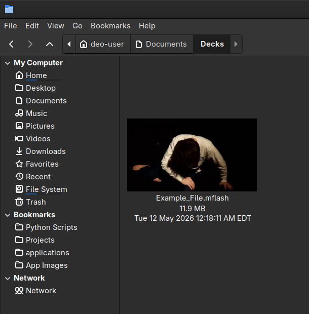
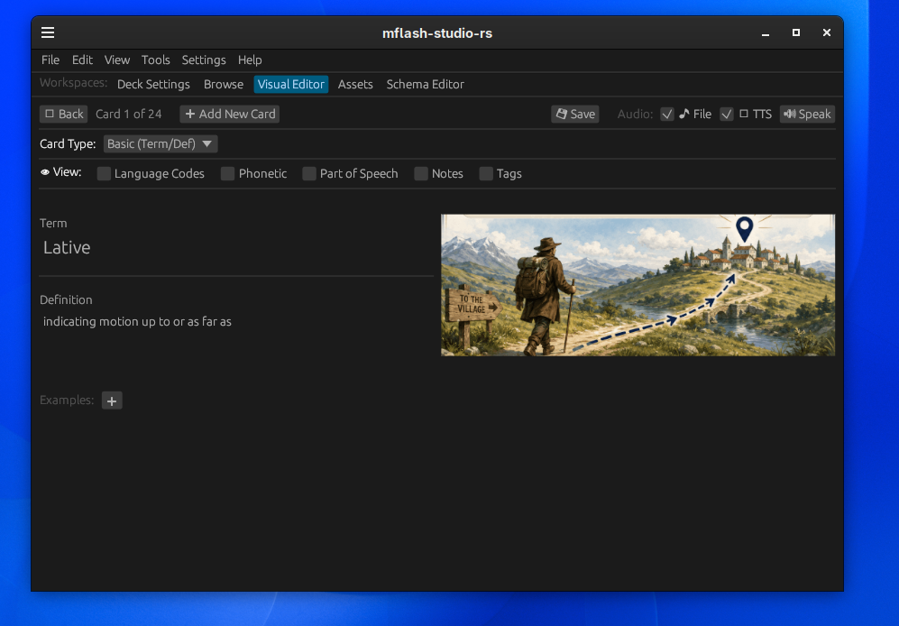
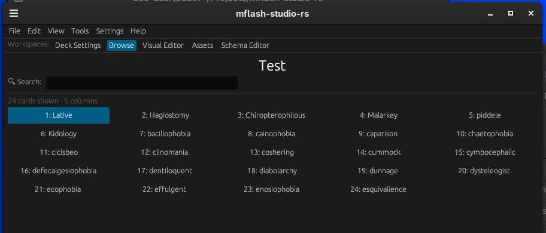
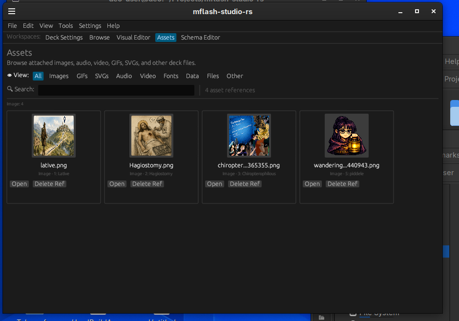
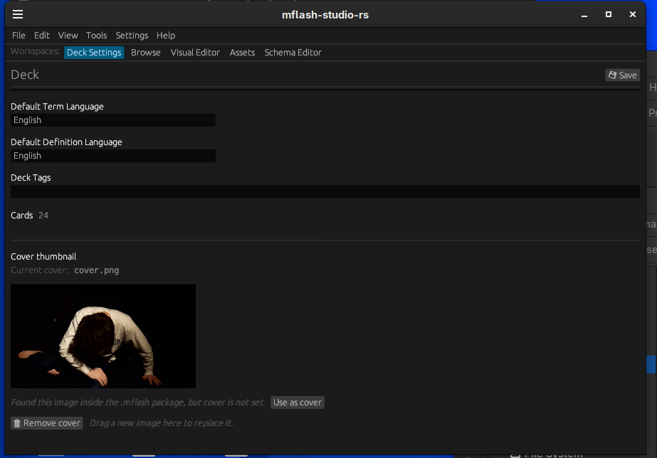
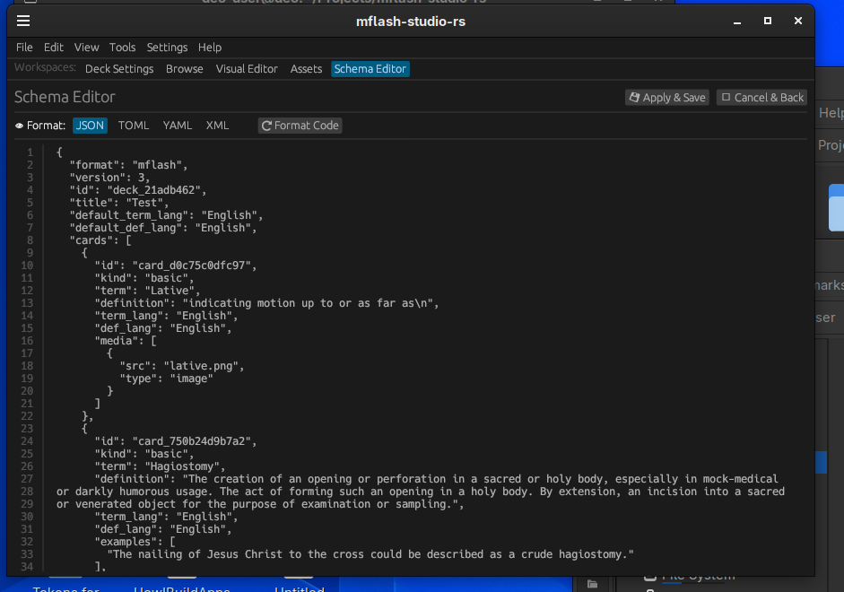

# MFlash Studio

**MFlash Studio** is a native Rust editor for building, inspecting, and refining `.mflash` flashcard decks.

It is part of the broader MFlash ecosystem: a set of tools for multilingual flashcards, deck editing, native desktop integration, media-rich study workflows, and future OS-level `.mflash` support.



## What It Does

MFlash Studio is designed as the flagship desktop editor for `.mflash` decks.

Current goals include:

- Open and inspect `.mflash` deck files.
- Edit flashcard content in a native desktop interface.
- Browse large decks quickly.
- Edit individual cards visually.
- Inspect and manage attached media assets.
- View and edit deck data through a schema editor.
- Support undo and redo while editing.
- Provide configurable app settings and workspace shortcuts.
- Support audio and text-to-speech settings for multilingual cards.
- Prepare the `.mflash` format for deeper OS integration later.

## Screenshots

### Visual Editor

The **Visual Editor** is the main card editing workspace. It focuses on one card at a time and supports term/definition editing, optional metadata fields, attached images, audio controls, and card navigation.



### Browse Workspace

The **Browse** workspace gives a compact overview of the deck so you can quickly jump into the card you want to edit.



### Assets Workspace

The **Assets** workspace shows attached deck media such as images, GIFs, SVGs, audio, video, and other referenced files. It is designed for quick inspection, deletion of asset references, and jumping from an asset back to its card.



### Deck Settings

The **Deck Settings** workspace edits deck-level metadata such as title, description, tags, default languages, and cover information.



### Schema Editor

The **Schema Editor** exposes the underlying deck data for direct inspection and editing.



## Features

### Workspaces

MFlash Studio currently includes several deck workspaces:

- **Deck Settings** — edit deck-level metadata.
- **Browse** — scan the deck in a compact card grid.
- **Visual Editor** — edit one flashcard at a time.
- **Assets** — inspect and manage attached media references.
- **Schema Editor** — inspect and edit the underlying deck data.

Workspaces can be shown or hidden through configuration, and keyboard shortcuts can jump directly to specific workspaces.

### Browse

The Browse workspace is designed for large decks. Instead of showing one long single-column list, it displays a dense grid of card terms and uses virtualized scrolling so massive decks remain practical to navigate.

### Visual Editor

The Visual Editor supports card-focused editing, including:

- Term and definition fields.
- Optional language code controls.
- Optional phonetic, part-of-speech, notes, and tags fields.
- Example sentence editing.
- Image display and drag-and-drop image replacement.
- Audio playback controls.
- Card type selection for future specialized card modes.

Current card types include:

- Basic
- Image Occlusion
- Listening
- Media Prompt
- Cloze

Some card types are still early placeholders while the editor architecture settles.

### Assets

The Assets workspace is for deck media references.

It currently supports:

- Dense grid browsing.
- Image and GIF thumbnails where available.
- Icons/placeholders for non-image assets.
- Filtering by asset type.
- Search by filename, type, or card term.
- Opening the related card in the Visual Editor.
- Removing an asset reference from a card.

The Assets workspace shows **asset references**, not every card. A card with no media does not appear there, and a card with multiple media files may appear more than once.

### Schema Editor

The Schema Editor is for direct deck data inspection and editing. It supports multiple schema views, including:

- JSON
- TOML
- YAML
- XML

The app syncs visual edits into schema text and can parse schema edits back into the deck.

### Settings / Preferences

MFlash Studio includes a settings dialog for app-wide preferences. The top-level **Settings** menu item and **Preferences…** command both open the same settings dialog.

Settings areas currently include:

- Global
- Flashcards
- SFX
- TTS
- Audio
- Plugins
- Schema / raw data editing preferences

### Audio

MFlash Studio includes early audio infrastructure for:

- UI sound effects.
- Save confirmation sounds.
- Text-to-speech playback.
- Future per-language voice profiles.
- Future media-file playback for attached audio.

The audio system is still in development, but the settings UI is being built around the idea that `.mflash` decks may contain multilingual content.

## Studio Shortcuts

Default shortcuts include:

| Shortcut | Action |
|---|---|
| `Ctrl + ,` | Open Settings / Preferences |
| `Ctrl + S` | Save current deck |
| `Ctrl + Z` | Undo last action |
| `Ctrl + Y` | Redo last action |
| `Arrow Up` / `Arrow Down` | Previous / next card or list item |
| `Arrow Left` / `Arrow Right` | Previous / next card |
| `Enter` | Open selected card in Visual Editor |
| `Escape` | Return to Browse |
| `Ctrl + Tab` | Next visible workspace |
| `Ctrl + Shift + Tab` | Previous visible workspace |
| `Ctrl + 1` | Deck Settings |
| `Ctrl + 2` | Browse |
| `Ctrl + 3` | Visual Editor |
| `Ctrl + 4` | Assets |
| `Ctrl + 5` | Schema Editor |
| `Ctrl + F` | Find in Schema Editor |
| `Ctrl + H` | Replace in Schema Editor |
| `F11` | Exit fullscreen |
| `Ctrl + Plus` | Zoom in |
| `Ctrl + Minus` | Zoom out |
| `Ctrl + 0` | Actual size |

Shortcuts are configurable in `config.toml`.

## Configuration

Configuration is managed through `config.toml`.

Current configuration areas include:

- **UI** — font sizing, initial window dimensions, and theme.
- **Audio** — global sound settings and playback rate.
- **Plugins** — enabled plugin list.
- **Workspaces** — show or hide workspace tabs.
- **Shortcuts** — keyboard mappings for navigation and app actions.

Example workspace visibility config:

```toml
[workspaces]
show_deck = true
show_browse = true
show_visual_editor = true
show_media = true
show_schema_editor = true

Example workspace shortcut config:

[shortcuts]
next_workspace = "Ctrl+Tab"
prev_workspace = "Ctrl+Shift+Tab"
workspace_deck = "Ctrl+1"
workspace_browse = "Ctrl+2"
workspace_visual_editor = "Ctrl+3"
workspace_media = "Ctrl+4"
workspace_schema_editor = "Ctrl+5"

--

## Development

Run the app locally:

cargo run

Format the code:

cargo fmt

Check that the project builds:

cargo check

Build a release binary:

cargo build --release
Project Structure
src/
├── dialogs/       # Floating dialogs such as Settings
├── menubar/       # Top menu bar modules
├── models/        # .mflash deck data models
├── plugins/       # Plugin loading
├── workspaces/    # Main editor workspaces
├── archive.rs     # .mflash archive loading/saving
├── config.rs      # App configuration
├── input.rs       # Shortcut handling
├── main.rs        # App entry point and workspace routing
├── media.rs       # Media loading helpers
└── sfx.rs         # UI sound effects
The MFlash Ecosystem

MFlash Studio is part of a larger .mflash ecosystem.

mflash-spec

The source-of-truth specification for the .mflash deck format.

moribund-flash

A lightweight companion flashcard app built with Tauri and JavaScript.

mflash-os-integrations

Native system integrations for .mflash files, including MIME types and future thumbnail generation.

Project Status

MFlash Studio is currently experimental and under active development.

Expect rough edges, goblin wiring, and occasional haunted drawers in the UI while the architecture settles.

License

Copyright © 2026.

Part of the MorFlashcards / Moribund Institute ecosystem.